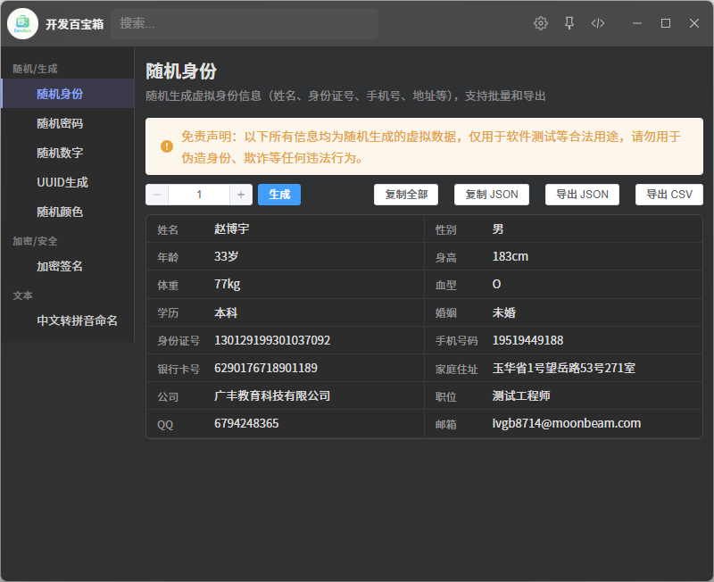

# 开发百宝箱 (devbox)

一款集成在 ZTools 中的实用工具箱，提供随机身份、密码、数字、UUID、颜色、加密签名、中文转拼音等多种生成工具。



## 工具列表

### 随机身份生成器
**触发指令**: `身份` / `身份证` / `随机身份` / `identity`

生成虚拟的身份信息，包含 16 个字段：
姓名、性别、年龄、身高、体重、血型、学历、婚姻、身份证号、手机号码、银行卡号、家庭住址、公司、职位、QQ、邮箱

**功能**:
- 批量生成（1-20 条）
- 复制全部 / 复制 JSON
- 导出 JSON / 导出 CSV

---

### 随机密码生成器
**触发指令**: `密码` / `随机密码` / `password`

生成安全的随机密码。

**可配置选项**:
- 密码长度（4-128 位）
- 字符集：大写字母、小写字母、数字、特殊符号
- 密码强度实时显示（弱/中/强/极强）

**一键复制**生成的密码。

---

### 随机数字生成器
**触发指令**: `随机数字` / `随机数` / `number`

在指定范围内生成随机数字。

**可配置选项**:
- 最小值、最大值
- 生成数量（1-1000 个）
- 小数位数（0-10 位）

---

### UUID 生成器
**触发指令**: `UUID` / `uuid` / `guid`

生成符合 RFC 4122 v4 规范的 UUID。

**可配置选项**:
- 批量生成数量

**一键复制**生成的 UUID。

---

### 随机颜色生成器
**触发指令**: `随机颜色` / `颜色` / `color`

生成随机颜色或手动调配。

**功能**:
- HSL 滑块精确调配颜色
- 一键随机生成
- 支持三种格式复制：HEX / RGB / HSL
- 颜色历史记录

---

### 加密签名生成器
**触发指令**: `加密` / `签名` / `hash` / `md5` / `sha`

将参数按规则拼接后生成加密签名。

**支持的算法**: MD5、SHA-1、SHA-256、SHA-512、HMAC-SHA256、HMAC-SHA512

**功能**:
- 自定义密钥（HMAC 模式需要）
- 自定义分隔符
- 结果一键复制

---

### 中文转拼音
**触发指令**: `拼音` / `中文转拼音` / `pinyin`

将中文文字转换为拼音。

**输出格式**:
- 全拼（小写/大写）
- 驼峰命名（camelCase / PascalCase）
- 下划线命名（snake_case）
- 常量命名（SNAKE_CASE）
- 首字母缩写

---

## 使用方式

1. 在 ZTools 搜索栏输入上述任意触发指令
2. 或在 ZTools 主界面点击「开发百宝箱」图标进入
3. 工具支持**一键复制**结果到剪贴板

---

## 开发者说明

> 以下内容面向插件开发者，普通用户无需关注。

### 技术栈

- Vue 3 + Vite + TypeScript
- Element Plus UI 组件库

### 项目结构

```
src/
├── tools/                    # 工具组件目录
│   ├── Identity/            # 随机身份
│   ├── RandomPassword/      # 随机密码
│   ├── RandomNumber/        # 随机数字
│   ├── UUID/                # UUID 生成
│   ├── RandomColor/         # 随机颜色
│   ├── Signature/           # 加密签名
│   └── Pinyin/             # 中文转拼音
├── toolbox/
│   ├── ToolboxLayout.vue   # 布局组件
│   └── tools.ts            # 工具注册表
└── App.vue                  # 根组件

public/
├── plugin.json              # 插件配置
├── logo.png                # 插件图标
└── preload/
    └── services.js         # Node.js 桥接服务
```

### 开发命令

```bash
npm install     # 安装依赖
npm run dev     # 启动开发服务器（http://localhost:5173）
npm run build   # 构建生产版本
```

### 添加新工具

1. 在 `src/tools/<ToolName>/index.vue` 创建 Vue 组件
2. 在 `src/toolbox/tools.ts` 的 `categories` 数组中注册
3. 在 `public/plugin.json` 的 `features` 数组中添加配置

### 配置文件

编辑 `public/plugin.json` 可修改插件名称、描述、版本及功能配置。每个功能的 `cmds` 数组定义了触发指令列表。
