# Imgbatch

## 🤖 关于本项目

本项目的**所有代码均由 AI（Artificial Intelligence）生成**，项目作者本人不具备相关编程知识，对代码内容不作任何技术层面的解释或保证。如果你遇到问题或有改进想法，欢迎自行修改、Fork 或提交 Issue。

Imgbatch 是一个面向 ZTools 的图片批量处理插件，提供本地离线的多种图片处理能力，适合快速处理一批图片并统一输出结果。

当前版本：`0.1.4`

## 0.1.4 更新

- 收口预览缓存清理链，稳定了切换功能页清理、设置页手动清空，以及普通退后台后的延时清理
- 图片列表右侧结果按钮逻辑补齐，正式处理完成后在当前配置未变化时会显示“查看结果”
- 如果对应结果文件已被手动删除，再点“查看结果”会自动回退为重新处理
- 调整预览缓存调试日志位置，随 `Imgbatch Preview` 一并清理，避免日志目录持续膨胀

## 0.1.3 更新

- 统一了图片输入信息的 descriptor 缓存层，导入、单图处理、合并链和结果读取会尽量复用同一份格式与元数据
- 收紧多处单图工具的重复输出逻辑，统一了质量默认值、输出路径、空操作直拷和部分 transformer 尾段处理
- 优化合并为 PDF、合并为图片、合并为 GIF 的前处理与兼容路径，降低卡顿并补齐更多格式兼容
- 结果对比页新增总体积变化汇总，并调整结果条排版层次
- 补边留白新增统一边距开关，并支持 `px / %` 双单位输入与边界限制
- 修正 GIF 压缩质量滑条无效的问题

## 0.1.2 更新

- 优化手动裁剪退出路径，减少返回工作区时的重刷感，并恢复到进入前的工具页
- 收紧右侧图片队列的局部刷新、虚拟列表重绘和处理中高频更新
- 补齐旋转、翻转、裁剪、留白、水印、圆角等工具的输出质量控制，并统一默认值为 `90`
- 新增队列缩略图质量设置，支持在设置页调整并即时重建缩略图
- 设置页改为全屏工作区模式，支持滚动和 `Esc` 退出
- 修正结果页、继续处理、确认框/预设框 `Esc` 等一批交互回归问题

## 界面预览

### 图片压缩

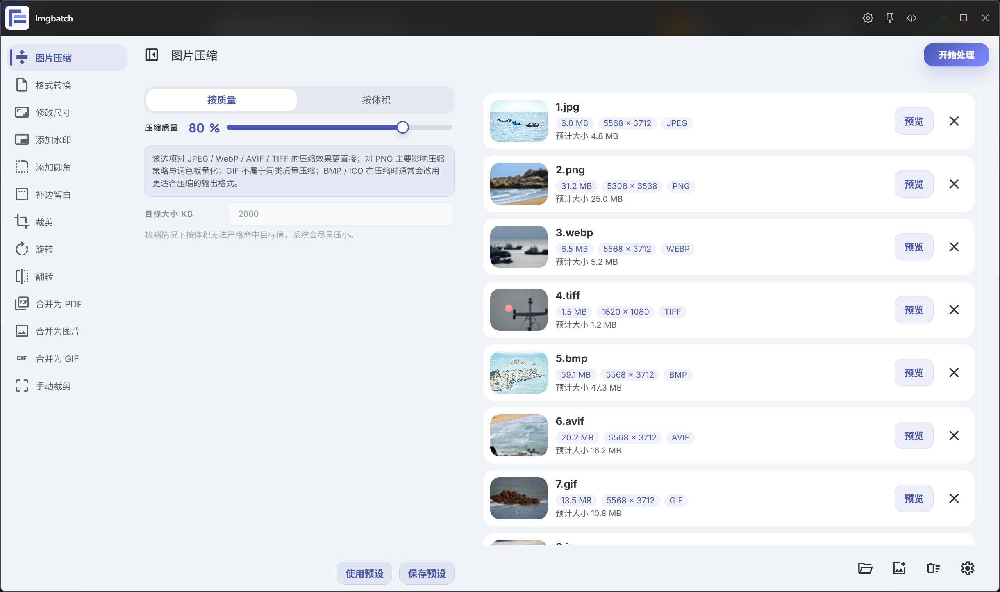

### 格式转换

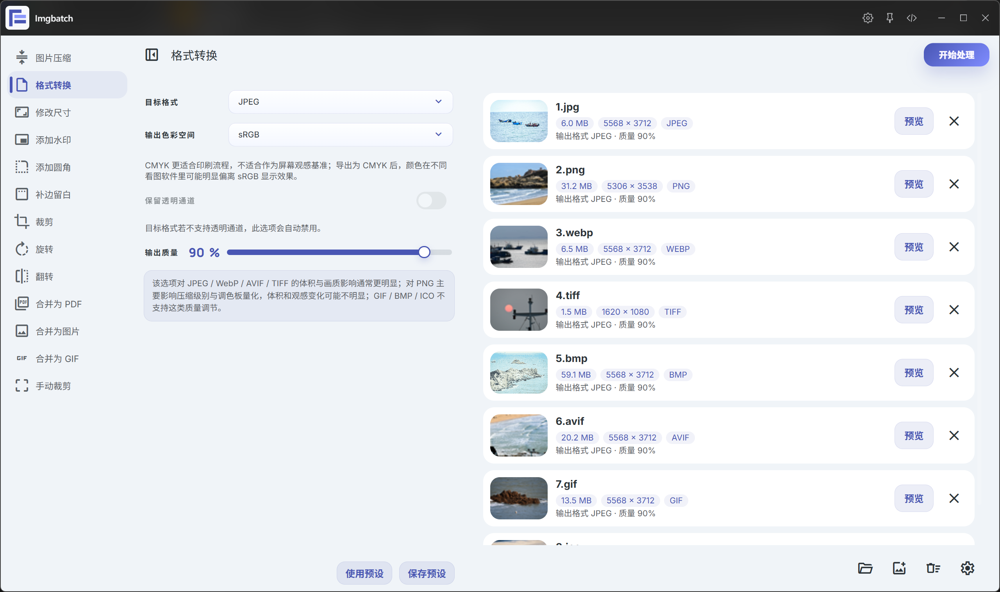

### 修改尺寸

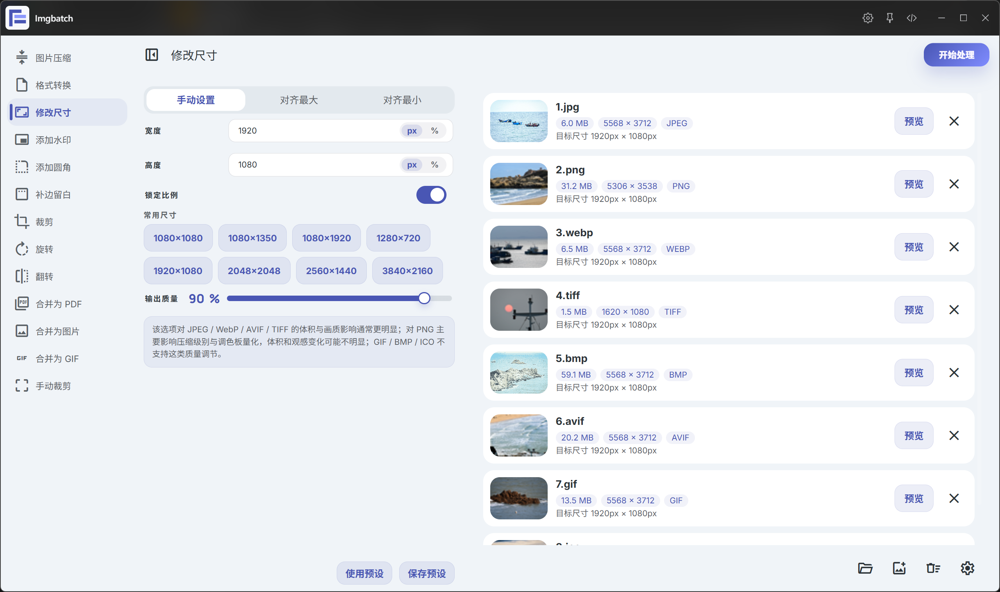

### 添加水印

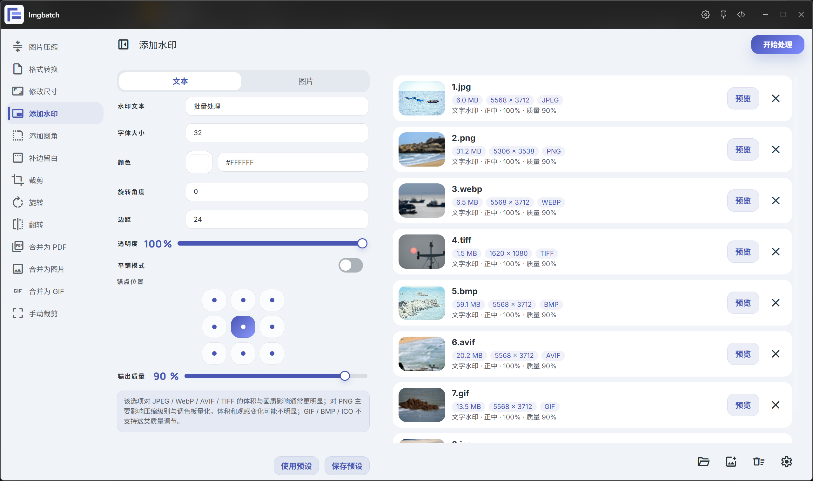

### 添加圆角

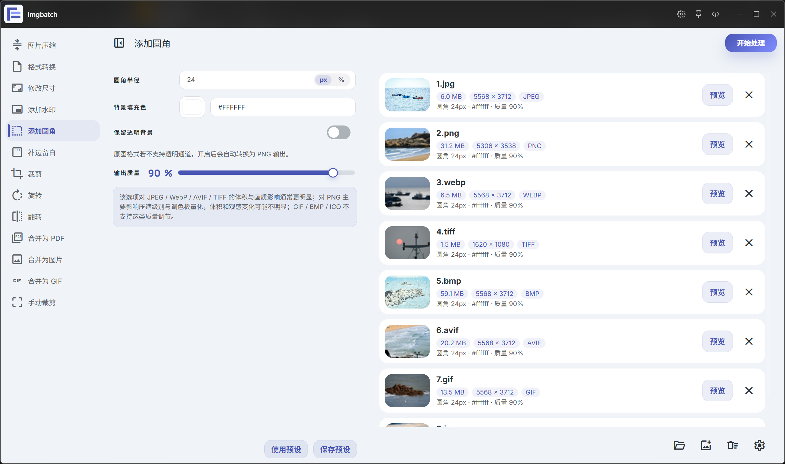

### 补边留白

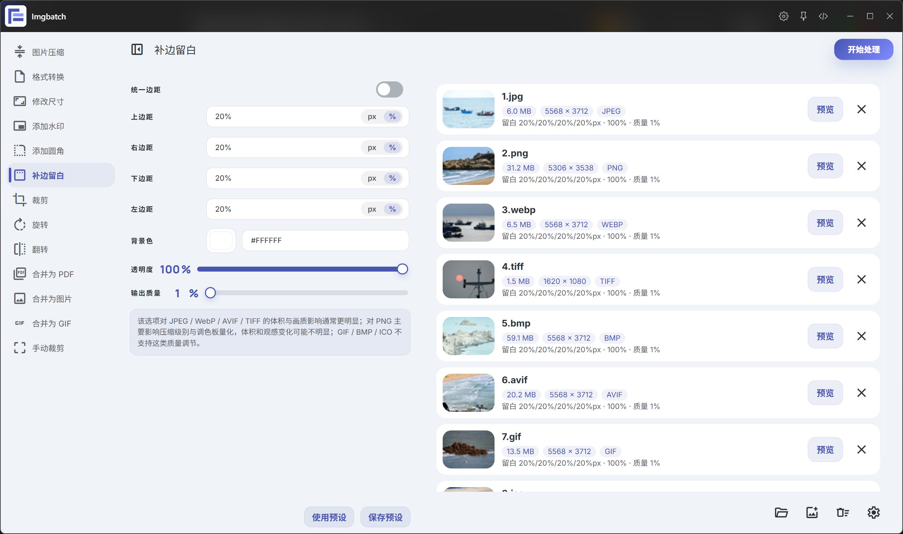

### 裁剪

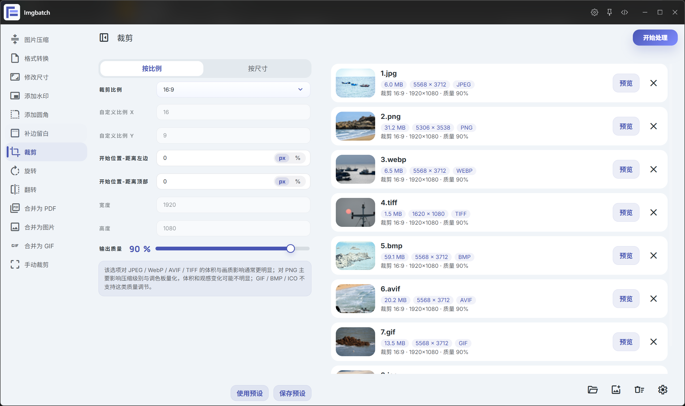

### 旋转

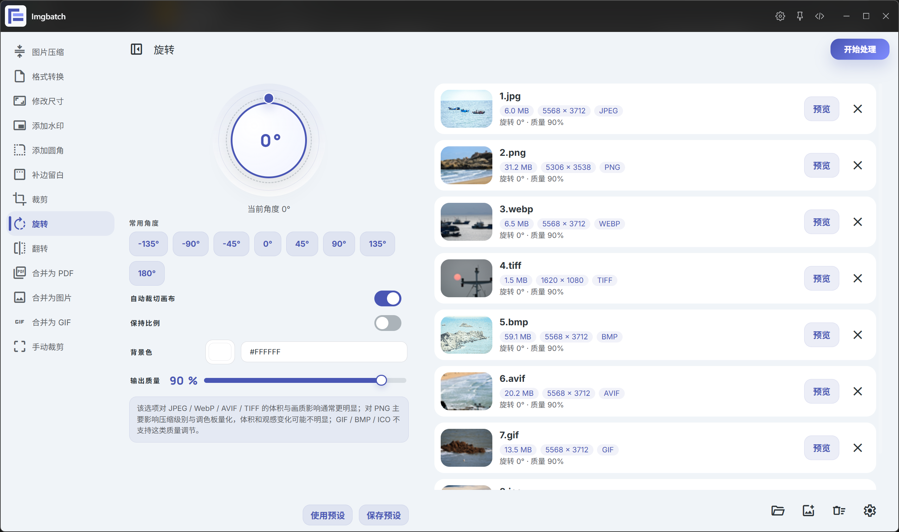

### 翻转

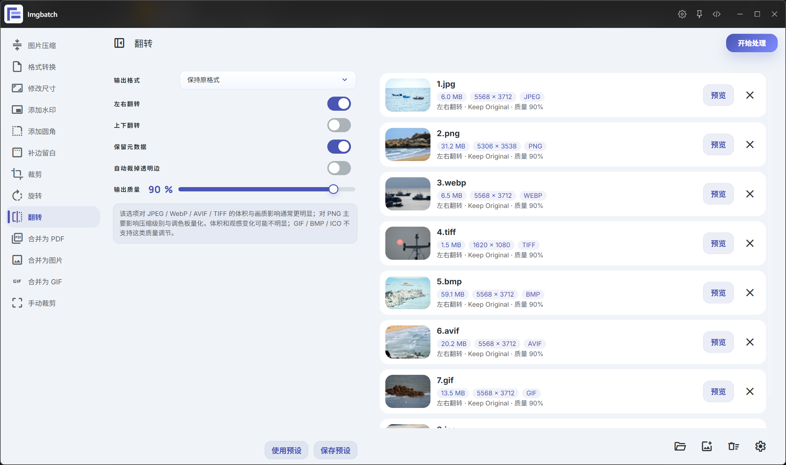

### 合并为 PDF

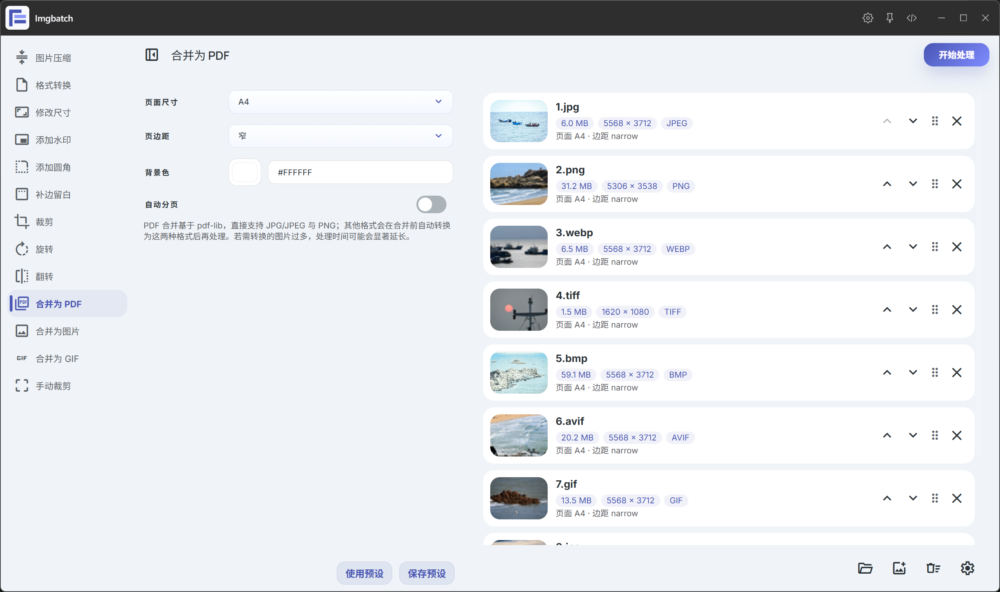

### 合并为图片

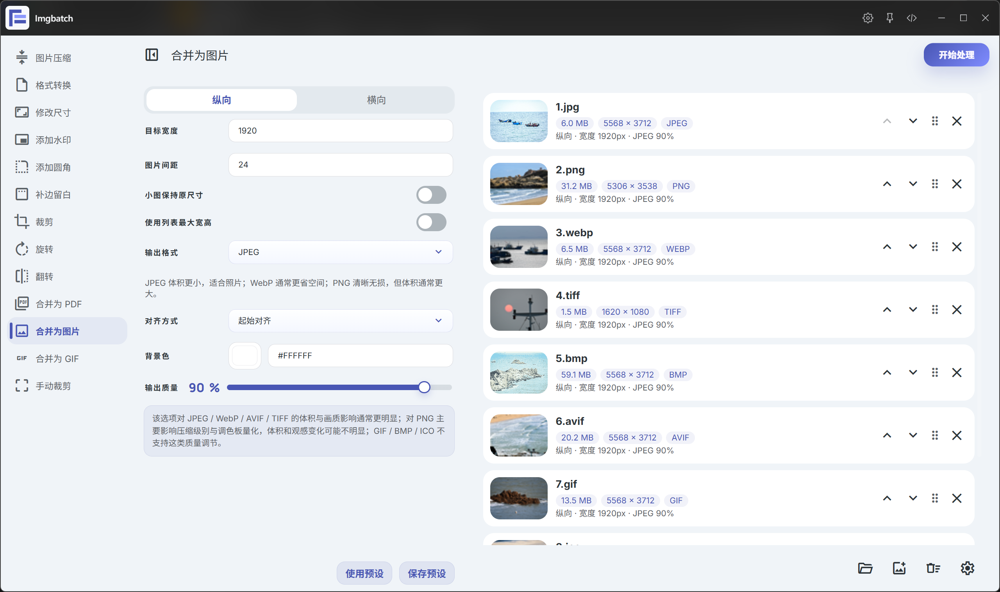

### 合并为 GIF

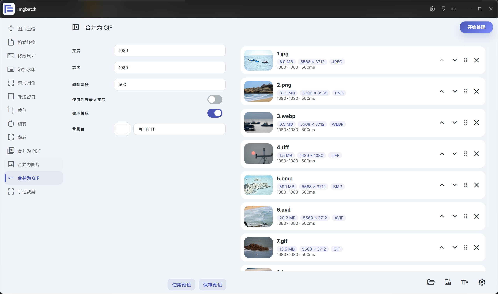

### 手动裁剪


### 预览效果

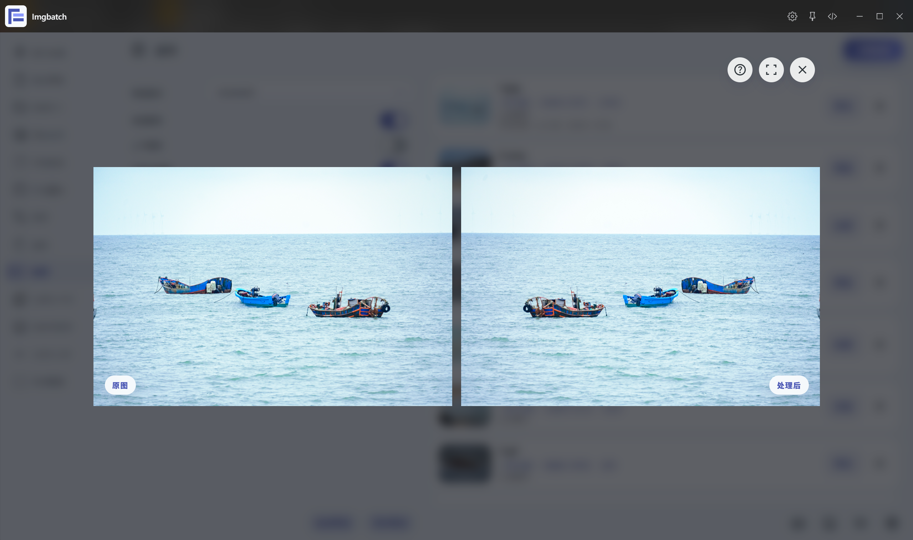


### 设置页


### 处理结果对比

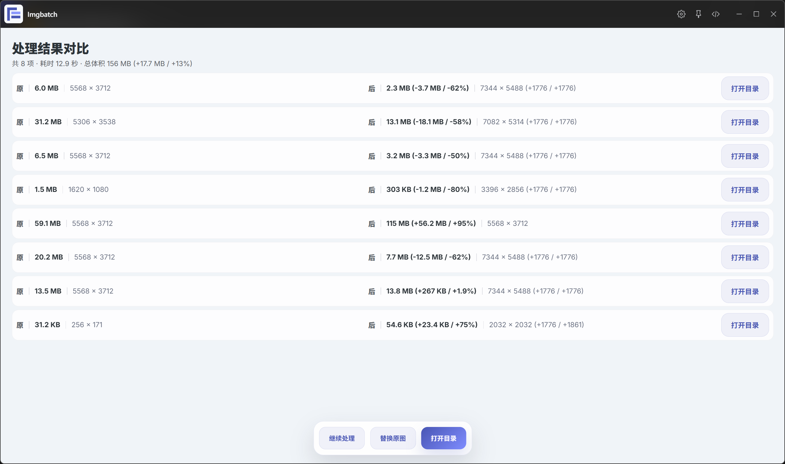

## 功能

- 图片压缩
- 格式转换
- 修改尺寸
- 添加水印
- 添加圆角
- 补边留白
- 裁剪
- 旋转
- 翻转
- 合并为 PDF
- 合并为图片
- 合并为 GIF
- 手动裁剪

## 手动裁剪特性

- 每张图片独立保存旋转、翻转、缩放、平移和裁剪框状态
- 支持滚轮缩放图片、右键拖动图片
- 支持方向键微调裁剪框
- 支持边缘吸附和吸附强度切换
- 支持自由拖动和固定比例四角拖动切换
- 支持连续处理整批图片，并在完成后汇总显示结果

## 支持的图片格式

导入触发和常规处理当前支持这些输入格式：

- `jpg`
- `jpeg`
- `png`
- `webp`
- `gif`
- `bmp`
- `tif`
- `tiff`
- `avif`
- `heic`
- `heif`

其中，列表缩略图、预览以及部分合并流程已经补齐了 `tiff`、`avif`、`bmp`、`ico` 等兼容处理。

## 运行环境

- ZTools
- Node.js `>= 16`

本插件依赖本地 Node 能力，核心依赖包括：

- `sharp`
- `pdf-lib`
- `gifenc`

## License

MIT

## 项目结构

```text
图片批量处理/
├── assets/         # 前端页面、状态、样式与组件
├── lib/            # preload 侧共享运行逻辑
├── index.html      # 插件页面入口
├── plugin.json     # ZTools 插件配置
├── preload.js      # 本地处理与 ZTools API 桥接
├── package.json    # 依赖配置
└── logo.png        # 插件图标
```

## 开发

安装依赖：

```bash
npm install
```

开发模式下，让 ZTools 读取当前开发目录即可。

## 打包测试

发布版本将通过 GitHub Releases 提供下载。

如果你想直接体验插件，请前往仓库的 Releases 页面下载对应版本的打包文件，并按 ZTools 的插件安装方式导入使用。

