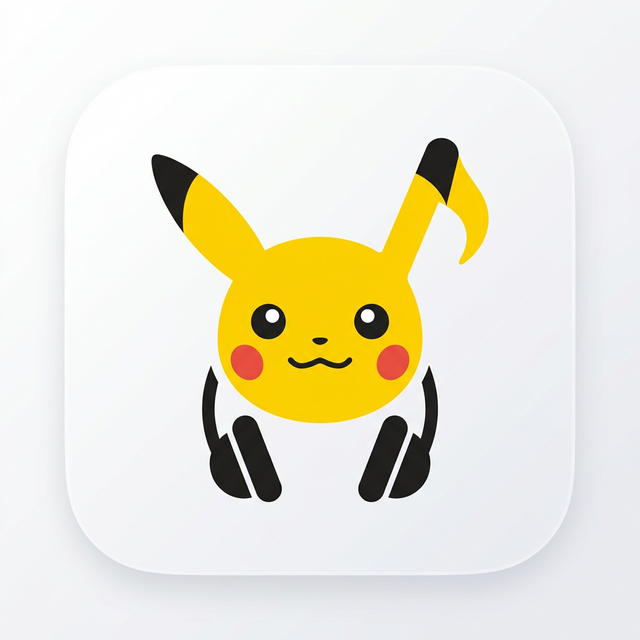

  

  <strong>学习收获更多有趣的内容, 欢迎关注微信公众号：Charles的皮卡丘</strong>

# 🌟 皮卡丘的音乐站 (MusicSquare)

MusicSquare 是一个基于 **Migu / Netease / QQ / Kuwo** 的高颜值、极简音乐搜索与播放工具。它提供了轻量级且用户勇好的界面，让你可以直接在浏览器或作为桌面插件搜索、播放及下载音乐。

---

## ✨ 核心特性

- 🎵 **多源聚合搜索**：集成咪咕、网易云、QQ 音乐、酷我等主流平台，一键搜索全网歌曲名或歌手名。
- 📻 **极简在线播放**：无需下载客户端，即扫即听，支持动态歌词高亮及炫酷霓虹视觉效果。
- 💛 **治愈系 UI 设计**：以皮卡丘为主题，界面圆润可爱，支持 **日/夜模式** 切换。
- ⌨️ **沉浸式快捷键**：完整的键盘操作支持，为你带来极客般的听歌体验。

---

## ⌨️ 快捷键指南

| 动作 | 快捷键 |
| :--- | :--- |
| **播放 / 暂停** | `Space` |
| **快退 / 快进** | `←` / `→` (5秒) |
| **音量调节** | `↑` / `↓` |
| **上一首 / 下一首** | `P` / `N` |
| **收藏歌曲** | `F` |
| **切换歌词动效** | `L` |
| **静音切换** | `M` |
| **聚焦搜索框** | `/` |
| **关闭弹窗** | `Esc` |

---

## 🛠️ 技术实现与定制化

项目采用原生 **HTML / CSS / JavaScript** 构建，确保了极高的加载速度。
- **UI 风格**: 基于 `style.css` 维护，采用圆润的视觉元素。
- **插件能力**: 通过 `preload.js` 释放沙箱限制，调用 Node.js 能力实现更强的功能。
- **自定义选项**:
  - 你可以在 `js/main.js` 中调整播放逻辑。
  - 修改 `plugin.json` 中的快捷唤起码。
  - 通过 CSS 自定义主题色和背景。

---

## 📄 版权声明
本站仅作为学习演示，所有音乐版权归各平台与原作者所有。请勿用于商业用途。
