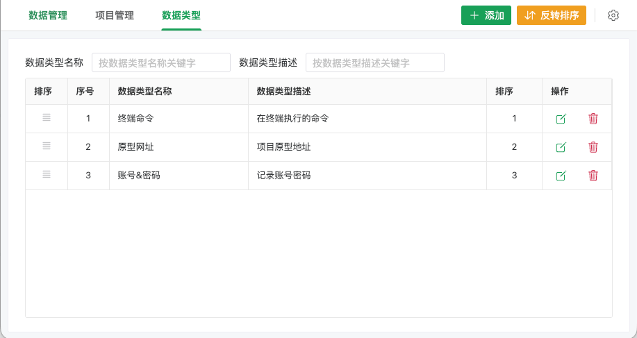
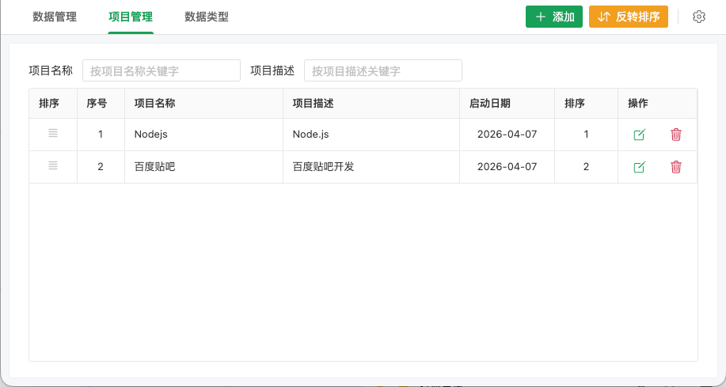
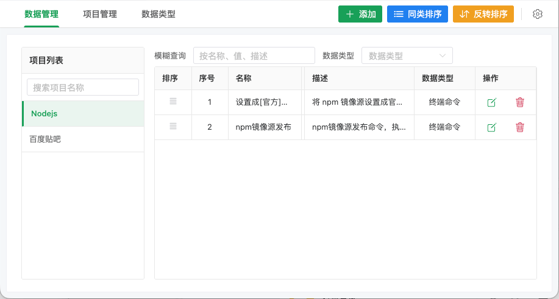

# 速记盒使用说明

## 📖 简介

速记盒是一个简洁高效的数据管理工具，帮助您快速记录和管理常用数据。

#### 数据类型

#### 项目管理

#### 数据管理

## 🚀 快速开始

在 ZTools 中输入 `速记盒` 或 `sj` 即可启动插件。

## 📋 使用说明

### 数据类型

对数据进行分类标记，如账号、网址、邮箱、终端命令、Git仓库地址等。

- ✅ 添加、编辑、删除
- ✅ 拖动排序
- ⚠️ 正在使用的类型无法删除

### 项目管理

创建项目分类，如工作、个人、学习、Node、Java、Golang等。

- ✅ 添加、编辑、删除
- ✅ 设置启动日期
- ✅ 拖动排序
- ⚠️ 有数据的项目无法删除

### 数据管理

管理具体的数据条目。

- 左侧选择项目，右侧显示数据
- ✅ 添加、编辑、删除
- ✅ 拖动排序
- ✅ 点击单元格快速复制
- ✅ 按类型过滤
- ✅ 模糊搜索

## 🎯 特色功能

- **同类排序** - 按数据类型顺序排列
- **反转排序** - 快速反转显示顺序
- **智能复制** - 点击单元格复制内容

## ❓ 常见问题

**Q: 为什么无法删除项目/类型？**
A: 有数据关联时无法删除，请先删除关联数据。

**Q: 数据存储在哪里？**
A: 数据存储于本地数据库，安全可靠；ZTools 的 WebDAV 同步功能可自动将数据同步至云端，保障数据安全及多端同步。

---

希望速记盒能帮助您更高效地管理数据！🎉
